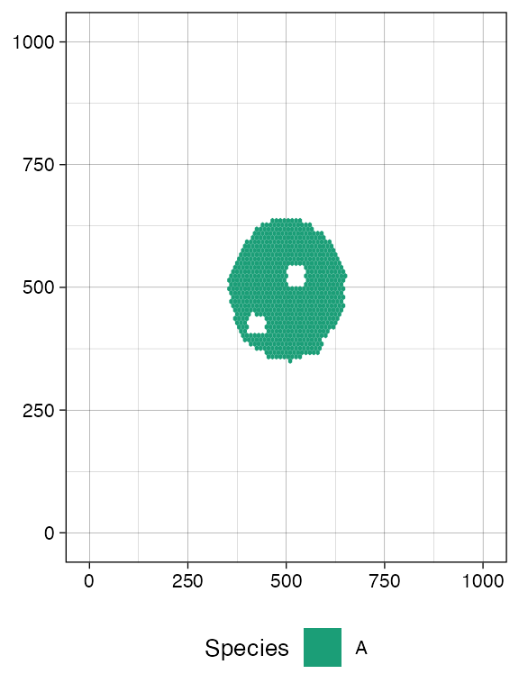

# Tissue sampling

> *Disclaimer:* ProCESS/CLONES implements probability distributions
> using the C++11 random number distribution classes. Since the standard
> does not specify the underlying algorithms, their implementations are
> left to the compiler. Consequently, the simulation output depends on
> the compiler used to build
> [CLONES](https://github.com/albertocasagrande/CLONES), and the results
> reported in this article may differ from those obtained by the reader.

Once one has familiarised oneself with how a tumour evolution simulation
can be programmed using ProCESS (see the [article on tissue
simulation](https://caravagnalab.github.io/ProCESS/1.3/articles/tissue_simulation.md)),
the next step is to augment the simulation with sampling of tumour
cells. This mimics a realistic experimental design in which we collect
tumour sequencing data.

This article introduces sampling using different types of models;
starting from simpler to more complex simulation scenarios. We consider:

- *multi-region sampling*: where at every time point multiple
  spatially-separated samples are collected;

- *longitudinal sampling*: where the sampling is repeated at multiple
  time-points.

## Custom multi-region sampling

We consider a simple monoclonal model, without an epi-state.

``` r

library("ProCESS")

# set the seed of the random number generator
set.seed(0)

# monoclonal model, no epigenetic state
sim <- TissueSimulation("Monoclonal")

sim$add_mutant("A", c(duplication = 0.1, death = 0.01))

sim$place_cell("A", 500, 500)
sim$run_up_to_size("A", 60000)
#>  [███████████████████████-----------------] 57% [00m:00s] Cells: 34458 [████████████████████████████████████----] 88% [00m:00s] Cells: 53311 [████████████████████████████████████████] 100% [00m:01s] Saving snapshot
```

``` r

current <- plot_tissue(sim)
current
```


A sample is defined by a name and a bounding box, which has (x,y)
coordinates for the bottom-left and top-right points.

For this simulation, we define two samples with names `S_1_1` and
`S_1_2`.

``` r

# collect a squared box of (bbox_width x bbox_width) cells
bbox_width <- 50

# box A1
bbox1_p <- c(400, 400)
bbox1_q <- bbox1_p + bbox_width

# box B1
bbox2_p <- c(500, 500)
bbox2_q <- bbox2_p + bbox_width

library(ggplot2)

# view the boxes
current +
  geom_rect(xmin = bbox1_p[1], xmax = bbox1_q[2],
            ymin = bbox1_p[1], ymax = bbox1_q[2],
            fill = NA, color = "black") +
  geom_rect(xmin = bbox2_p[1], xmax = bbox2_q[2],
            ymin = bbox2_p[1], ymax = bbox2_q[2],
            fill = NA, color = "black")
```


``` r


# collect two samples from the two boxes
sim$sample_cells("S_1_1", bottom_left = bbox1_p, top_right = bbox1_q)
sim$sample_cells("S_1_2", bottom_left = bbox2_p, top_right = bbox2_q)
```

> *Note:* Sampling removes cells from the tissue, as if the tissue were
> surgically resected. Therefore, cells that are mapped to the bounding
> box after application of
> [`TissueSimulation$sample_cells()`](https://caravagnalab.github.io/ProCESS/1.3/reference/TissueSimulation-cash-sample_cells.md)
> are no longer part of the simulation.

A new call to
[`plot_tissue()`](https://caravagnalab.github.io/ProCESS/1.3/reference/plot_tissue.md)
will show the box where the cells have been removed to be white.

``` r

plot_tissue(sim)
```



This is also reflected by
[`TissueSimulation$get_cells()`](https://caravagnalab.github.io/ProCESS/1.3/reference/TissueSimulation-cash-get_cells.md),
which now will not find any tumour cells in the sampled region.

``` r

library(dplyr)
#> 
#> Attaching package: 'dplyr'
#> The following objects are masked from 'package:stats':
#> 
#>     filter, lag
#> The following objects are masked from 'package:base':
#> 
#>     intersect, setdiff, setequal, union

# this should be empty
sim$get_cells(c(400, 400), c(400 + bbox_width, 400 + bbox_width)) %>% head
#> [1] cell_id    mutant     position_x position_y
#> <0 rows> (or 0-length row.names)
```

The sampling process exclusively collects tumour cells, while excluding
wild-type cells.

### The sample forest

Every sampled cell is linked, at the evolutionary level, to the other
cells that originate from the same initial cell. It helps to visualise
the evolutionary information on the cells that we have sampled as a
forest of trees (if one seeded multiple initial cells). The forest is an
object of the R6 class `SampleForest`.

``` r

forest <- sim$get_sample_forest()

forest
#> SampleForest
#>   # of trees: 1
#>   # of nodes: 20609
#>   # of leaves: 5138
#>   samples: {"S_1_1", "S_1_2"}
```

The forest has methods to obtain the nodes of the sampled cells.

``` r

forest$get_nodes() %>% head
#>   cell_id ancestor depth mutant sample birth_time
#> 1       1       NA     0      A   <NA>   0.000000
#> 2       2        1     1      A   <NA>   5.741436
#> 3       3        1     1      A   <NA>   5.741436
#> 4       4        3     2      A   <NA>   9.232361
#> 5       5        3     2      A   <NA>   9.232361
#> 6       7        2     2      A   <NA>  18.320988
```

The leaves of the forest are sampled cells, while the internal nodes are
their ancestors. The field `sample` is not available for internal nodes,
and reports the sample name otherwise.

``` r

# the leaves in the forest represent sampled cells
forest$get_nodes() %>%
  filter(!is.na(.data$sample)) %>%
  head
#>   cell_id ancestor depth mutant sample birth_time
#> 1   31538    27664    36      A  S_1_2   272.5988
#> 2   31865    18506    58      A  S_1_2   273.5142
#> 3   36856    27328    40      A  S_1_2   288.0925
#> 4   41971    41050    38      A  S_1_2   301.4074
#> 5   44185    42456    69      A  S_1_2   306.8085
#> 6   48130    45312    38      A  S_1_2   316.1062
```

The roots of the forest have no ancestors.

``` r

# if it is one cell, then the forest is a tree
forest$get_nodes() %>%
  filter(is.na(.data$ancestor))
#>   cell_id ancestor depth mutant sample birth_time
#> 1       1       NA     0      A   <NA>          0
```

We can also query the forest about the samples used to build it.

``` r

forest$get_samples_info()
#>    name id xmin ymin xmax ymax tumour_cells tumour_cells_in_bbox     time
#> 1 S_1_1  0  400  400  450  450         2567                 2567 621.5132
#> 2 S_1_2  1  500  500  550  550         2571                 2571 621.5132
```

We can visualise the forest. This plot reports the cells and, on the
y-axis, their time of birth.

``` r

plot_forest(forest)
```


The plot also shows sample annotations and species, but for a large
number of cells, it can be difficult to view the full forest, unless a
very large canvas is used. For this reason, it is possible to subset the
forest.

``` r

# extract the subforest linked to sample
S_1_1_forest <- forest$get_subforest_for("S_1_1")

plot_forest(S_1_1_forest)
```


In general, these plots can be annotated with extra information, such as
the sampling times and the MRCAs of each sample in the forest.

``` r

# full plot
plot_forest(forest) %>%
  annotate_forest(forest)
```


``` r

# S_1_1 plot
plot_forest(S_1_1_forest) %>%
  annotate_forest(S_1_1_forest)
```


## Randomised multi-region samples

``` r

# set the seed of the random number generator
set.seed(0)

sim <- TissueSimulation("Randomised")

sim$add_mutant("A", c(duplication = 0.1, death = 0.01))

sim$place_cell("A", 500, 500)
sim$run_up_to_size("A", 60000)
#>  [██████████████████████------------------] 54% [00m:00s] Cells: 32856 [███████████████████████████████████-----] 87% [00m:00s] Cells: 52303 [████████████████████████████████████████] 100% [00m:01s] Saving snapshot
```

We include a new mutant and let it grow. This new mutant has much higher
growth rates than its ancestor.

``` r

# add a new mutant
sim$add_mutant("B", c(duplication = 1, death = 0.01))
sim$mutate_progeny(sim$choose_border_cell_in("A"), "B")

sim$run_up_to_size("B", 10000)
#>  [████████████████████████████████████████] 100% [00m:00s] Saving snapshot

current <- plot_tissue(sim)
current
```


ProCESS provides a
[`TissueSimulation$search_sample()`](https://caravagnalab.github.io/ProCESS/1.3/reference/TissueSimulation-cash-search_sample.md)
function to sample bounding boxes that contain a desired number of
cells. The function takes in input:

- a bounding box size;
- the number n of cells to sample for a species of interest.

[`TissueSimulation$search_sample()`](https://caravagnalab.github.io/ProCESS/1.3/reference/TissueSimulation-cash-search_sample.md)
will attempt a fixed number of times to sample the box, starting from
positions occupied by the species of interest. If a box that contains at
least n cells is not found within a number of attempts, then the one
with the largest number of samples is returned.

This allows for programming sampling without having a clear idea of the
tissue conformation.

``` r

# a bounding box 50x50 with at least 100 cells of species B
n_w <- n_h <- 50
ncells <- 0.8 * n_w * n_h

# sampling ncells with random box sampling of boxes of size n_w x n_h
bbox <- sim$search_sample(c("B" = ncells), n_w, n_h)

# plot the bounding box
current +
  geom_rect(xmin = bbox$lower_corner[1], xmax = bbox$upper_corner[1],
            ymin = bbox$lower_corner[2], ymax = bbox$upper_corner[2],
            fill = NA, color = "black")
```


``` r

# sample the tissue
sim$sample_cells("S_2_1", bbox$lower_corner, bbox$upper_corner)
```

Something similar to species `A`.

``` r

bbox <- sim$search_sample(c("A" = ncells), n_w, n_h)

# plot the bounding box
current +
  geom_rect(xmin = bbox$lower_corner[1], xmax = bbox$upper_corner[1],
            ymin = bbox$lower_corner[2], ymax = bbox$upper_corner[2],
            fill = NA, color = "black")
```


``` r

# sample the tissue
sim$sample_cells("S_2_2", bbox$lower_corner, bbox$upper_corner)
```

The two samples have been extracted.

``` r

plot_tissue(sim)
```


We can build the sample forest.

``` r

forest <- sim$get_sample_forest()

plot_forest(forest) %>%
  annotate_forest(forest)
```


## Randomised cell sampling (Liquid biopsy)

ProCESS supports randomised cell sampling over the full tissue or a
rectangle thereof.

``` r

# collect up to 2500 tumour cells randomly selected over the whole tissue
sim$sample_cells("S_2_3", num_of_cells = 2500)

bbox <- sim$search_sample(c("A" = ncells), n_w, n_h)

# collect up to 200 tumour cells randomly selected in the provided
# bounding box
sim$sample_cells("S_2_4", bbox$lower_corner, bbox$upper_corner, 200)

forest <- sim$get_sample_forest()

plot_forest(forest) %>%
  annotate_forest(forest)
```


## Two populations with epigenetic states

We are now ready to simulate a model with epigenetic states and
sub-clonal expansions. The following example uses two epigenetic states.
However, user can create as many epigenetic states as they need.

``` r

# set the seed of the random number generator
set.seed(0)

sim <- TissueSimulation("Two Populations", epigenetic_states = c("E1", "E2"))

sim$death_activation_level <- 20

# add mutant "A" and set its species rates
sim$add_mutant("A", list(E1 = list(duplication = 0.1, death = 0.1, E2 = 0.01),
                         E2 = list(duplication = 0.08, death = 0.01,
                                   E1 = 0.01)))

sim$place_cell("A[E1]", 500, 500)
sim$run_up_to_size("A[E1]", 1000)
#>  [███████████████████████████████---------] 76% [00m:00s] Cells: 24618 [████████████████████████████████████████] 100% [00m:00s] Saving snapshot
plot_tissue(sim, num_of_bins = 500)
```


We sample before introducing a new mutant.

``` r

bbox_width <- 10

sim$sample_cells("S_1_1",
                 bottom_left = c(480, 480),
                 top_right = c(480 + bbox_width, 480 + bbox_width))

sim$sample_cells("S_1_2",
                 bottom_left = c(500, 500),
                 top_right = c(500 + bbox_width, 500 + bbox_width))

plot_tissue(sim, num_of_bins = 500)
```


``` r

# let the simulation evolve for further 15 time units
sim$run_up_to_time(sim$get_clock() + 15)
#>  [████████████████████████████████████████] 100% [00m:00s] Saving snapshot

plot_tissue(sim, num_of_bins = 500)
```


Add a new submutant.

``` r

cell <- sim$choose_border_cell_in("A")

sim$add_mutant("B", list(E1 = list(duplication = 0.08, death = 0.05, E2 = 0.05),
                         E2 = list(duplication = 0.3, death = 0.05, E1 = 0.1)))

sim$mutate_progeny(cell, "B")

# let it grow more
sim$run_up_to_size("B[E1]", 7000)
#>  [█████-----------------------------------] 10% [00m:00s] Cells: 53012 [████████████████------------------------] 38% [00m:00s] Cells: 66590 [███████████████████████████-------------] 66% [00m:01s] Cells: 78132 [█████████████████████████████████████---] 92% [00m:02s] Cells: 87562 [████████████████████████████████████████] 100% [00m:03s] Saving snapshot

plot_tissue(sim, num_of_bins = 500)
```


Sample again and plot the tissue

``` r

n_w <- n_h <- 25
ncells <- 0.9 * n_w * n_h

bbox <- sim$search_sample(c("A" = ncells), n_w, n_h)
sim$sample_cells("S_2_1", bbox$lower_corner, bbox$upper_corner)

bbox <- sim$search_sample(c("B" = ncells), n_w, n_h)
sim$sample_cells("S_2_2", bbox$lower_corner, bbox$upper_corner)

plot_tissue(sim, num_of_bins = 500)
```


``` r

plot_muller(sim)
```


Now we show the sample forest, which starts being rather complicated

``` r

forest <- sim$get_sample_forest()

plot_forest(forest) %>%
  annotate_forest(forest)
```


### Storing Samples Forests

A sample forest can be saved in a file by using the method
[`SampleForest$save()`](https://caravagnalab.github.io/ProCESS/1.3/reference/SampleForest-cash-save.md).

``` r

# check the file existence. It should not exist.
file.exists("sample_forest.sff")
#> [1] FALSE

# save the sample forest in the file "sample_forest.sff"
forest$save("sample_forest.sff")

# check the file existence. It now exists.
file.exists("sample_forest.sff")
#> [1] TRUE
```

The saved sample forest can successively be loaded by using the function
[`load_sample_forest()`](https://caravagnalab.github.io/ProCESS/1.3/reference/load_sample_forest.md).

``` r

# load the sample forest from "sample_forest.sff" and store it in `forest2`
forest2 <- load_sample_forest("sample_forest.sff")

# let us now compare the sample forests stored in `forest` and `forest2`;
# they should be the same.
forest
#> SampleForest
#>   # of trees: 1
#>   # of nodes: 6233
#>   # of leaves: 1424
#>   samples: {"S_1_1", "S_1_2", "S_2_1", "S_2_2"}
forest2
#> SampleForest
#>   # of trees: 1
#>   # of nodes: 6233
#>   # of leaves: 1424
#>   samples: {"S_1_1", "S_1_2", "S_2_1", "S_2_2"}
```
