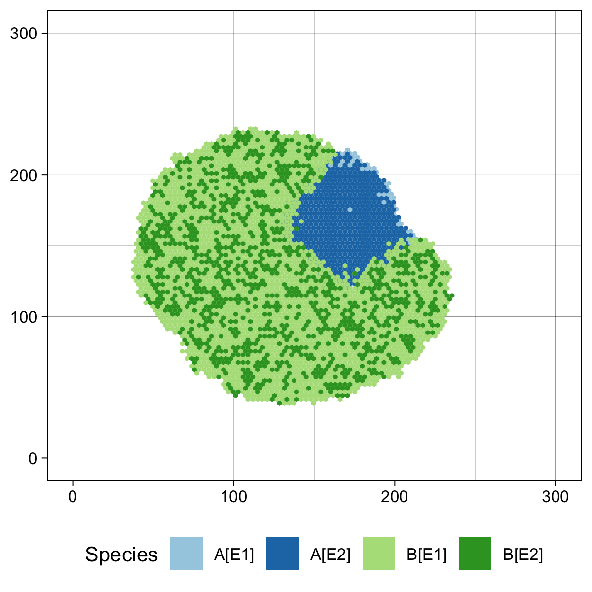
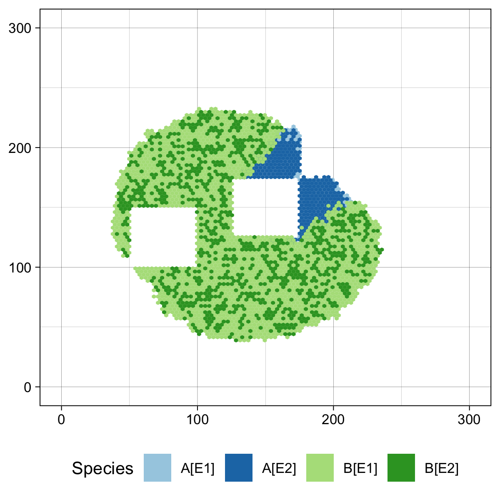
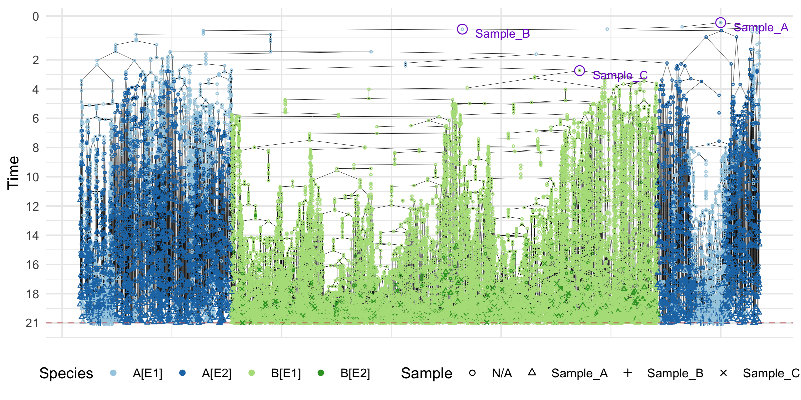

# ProCESS

`ProCESS` stands for Programmable Cancer Evolution Spatial Simulator. It
is an R wrapper for
[CLONES](https://github.com/albertocasagrande/CLONES), a C++ tumour
evolution simulator, and provides additional plotting functions.

------------------------------------------------------------------------

#### Help and support

[](https://caravagnalab.github.io/ProCESS/1.3)

------------------------------------------------------------------------

### Installation

In order to install the development version of `ProCESS`, you need:

- [R and Rtools](https://cran.r-project.org)

- the R package [`pak`](https://pak.r-lib.org)

- [git](https://git-scm.com/downloads)

When the requirements have been satisfied, issue the R command:

``` r

pak::pak("caravagnalab/ProCESS@1.3")
```

------------------------------------------------------------------------

### A Simple Example

Once `ProCESS` has been install, it can be loaded as follows.

``` r

library(ProCESS)
```

Then, we can define a tissue model with 2 epigenetic states, `E1` and
`E2`, and 2 mutants, `A` and `B`, and let the model evolve until the
number of cells in mutant `B` with epigenetic state `E1` are less than
20k. The resulting simulated tissue can be sampled.

``` r

# set the seed of the random number generator for repeatability
set.seed(0)

# create a tissue simulation with two epigenetic states
sim <- TissueSimulation(epigenetic_states = c("E1", "E2"),
                        width = 300, height = 300)

# add a mutant "A" and set its species rates
sim$add_mutant("A", list(E1 = list(duplication = 2, death = 1, E2 = 0.12),
                         E2 = list(duplication = 0.8, death = 0.1, E1 = 0.12)))

# place one cell of "A" in epigenetic state "E1"
sim$place_cell("A[E1]", 150, 150)

# let the simulation evolve until the species "A[E2]" has less than 10 cells
sim$run_up_to_size("A[E2]", 10)
#>  [████████████████████████████████████████] 100% [00m:00s] Saving snapshot

# add a mutant "B" and set its species rates
sim$add_mutant("B", list(E1 = list(duplication = 3, death = 1, E2 = 0.12),
                         E2 = list(duplication = 1.3, death = 1, E1 = 0.12)))

# choose a border cell in "A" and let one of its progeny mutate in "B"
sim$mutate_progeny(sim$choose_border_cell_in("A"), "B")

# let the simulation evolve until the species "A[E2]" has less than 3000 cells
# avoid the progress bar
sim$run_up_to_size("B[E1]", 2e4, quiet = TRUE)

# plot the tissue
plot_tissue(sim)
```



``` r


# collect 3 samples: "Sample_A", "Sample_B", and "Sample_C"
sim$sample_cells("Sample_A", c(125, 125), c(175, 175))
sim$sample_cells("Sample_B", c(175, 175), c(225, 225))
sim$sample_cells("Sample_C", c(50, 100), c(100, 150))

# plot the tissue
plot_tissue(sim)
```



The collected samples can be used to build a sample forest whose nodes
represent simulated cells. The forest can be plot and annotate.

``` r

# get the sample forest
sample_forest <- sim$get_sample_forest()

# plot it
plot_forest(sample_forest) %>% 
  annotate_forest(sample_forest)
```



Finally, `ProCESS` can label each node in the forest by the genome of
the corresponding cell and also simulate the DNA sequencing of the
sampled cells.

For all the details about the above model and more advanced usage
examples, please refer to

[](https://caravagnalab.github.io/ProCESS/1.3)

------------------------------------------------------------------------

#### Copyright and contacts

- Alberto Casagrande, Computational Biology and <Bioinformatics@UniUd>.
- Giulio Caravagna, Cancer Data Science (CDS) Laboratory.

[](https://github.com/albertocasagrande/)
[](https://github.com/caravagnalab/)
[](https://bioinf.dimi.uniud.it/)
[](https://www.caravagnalab.org/)
