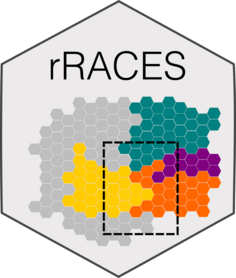

  
  ```{r, include = FALSE}
knitr::opts_chunk$set(
  collapse = TRUE,
  comment = "#>",
  fig.path = "man/figures/README-",
  out.width = "100%"
)
```

# ProCESS <a href="caravagnalab.github.io/ProCESS"></a>


<!-- badges: start -->
<!--  
  [](https://github.com/caravagnalab/ProCESS/actions)
[](https://github.com/caravagnalab/ProCESS/actions/workflows/pkgdown.yaml)
-->
<!-- badges: end -->
  
`ProCESS` stands for Programmable Cancer Evolution Spatial Simulator.
It is an R wrapper for
[RACES](https://github.com/albertocasagrande/RACES), a C++ tumour
evolution simulator, and provides additional plotting functions.

#### Help and support

[](https://caravagnalab.github.io/ProCESS/)
-----

### Installation

In order to install the development version of `ProCESS`, you need:

* [R and Rtools](https://cran.r-project.org).

* the R package [`devtools`](https://devtools.r-lib.org).

* [git](https://git-scm.com/downloads).


When the requirements have been satisfied, issue the R command:

``` r
devtools::install_github("caravagnalab/ProCESS")
```

Tissue plotting requires the R package 
[`hexbin`](https://cran.r-project.org/web/packages/hexbin/index.html)
under GNU/Linux and Windows.

-----
  
#### Copyright and contacts
  
Giulio Caravagna, Alberto Casagrande. Cancer Data Science (CDS) Laboratory.

[](https://github.com/caravagnalab/)
[](https://www.caravagnalab.org/)
