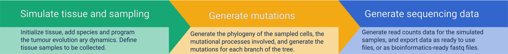
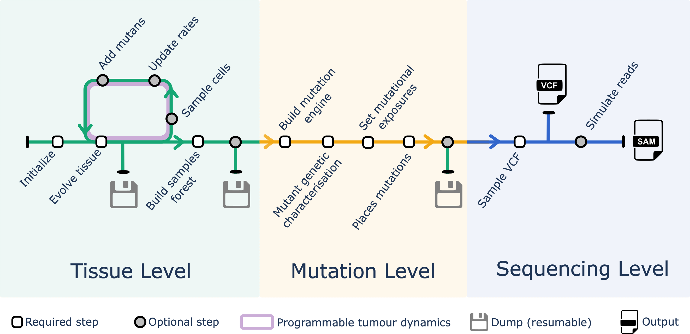

```{r, include = FALSE}
knitr::opts_chunk$set(
  collapse = TRUE,
  comment = "#>"
)
```

ProCESS wraps the [CLONES](https://github.com/albertocasagrande/CLONES) simulation
and data-generation engine by using the
[R/C++ Rcpp interface](https://www.rcpp.org/), making it easy to "program"
stochastic tumour evolution.

# Pipeline overview

<br>

ProCESS's pipeline consists of three steps.

1. a discrete tissue is first simulated, with distinct clones defined by
   stochastic rates of growth and death. These compete to colonise the tissue
   in a standard stochastic birth-death process, which in ProCESS is empowered
   by a time-varying structure that enables easily modelling of complex
   evolutionary forces that vary over time (e.g., therapy-induced negative
   selection). The tissue can be sampled at multiple time-points and in
   multiple spatially separated positions.

2. from the sampled cells, the simulated phylogenetic history of the tumour
   can be extracted. The distance among the involved cells will represent the
   lineage history of the simulated clones, and mutational processes can be
   used to attach genomes to each simulated cell. ProCESS supports standard
   germline and somatic mutations, including single-nucleotide variants (SNVs),
   insertion-deletions (indels) and copy number alterations (CNAs). For SNVs
   and indels, time-varying mutational signatures can also be included.

3. from the simulated phylogenetic history of the tumour, it is possible to
   generate tumour-matched-normal synthetic data for benchmarking
   bioinformatics tools, or to infer parameters against real sequencing data.
   ProCESS output includes common VCF formats, as well as low-level SAM
   outputs for alignment and downstream analysis. Every
   simulated sample can be assigned custom coverage and purity.

## Main features

The ProCESS engine has a number of features, the most relevant of which are:

1. Cells are associated with species that proliferate in a stochastic fashion
   on a 2D lattice.
2. Every species is defined by *(i)* an abstract  "mutant" and *(ii)* an
   epi-state; the epi-state is binary (0/1, on-off). The combination of the
   mutant and the epi-state determines the evolutionary parameters of each
   species, which can change over time mimicking treatment-related
   evolutionary pressures, for instance.
3. Species evolution is stochastic and follows a no-back mutation model,
   where at every cell division the mutant status is heritable, while the
   epi-state can be stochastically reversible.
3. At the molecular level, the genomes of tumour cells are mutated by simple
   mutations (SNVs and indels) and more complex CNAs. Mutations - in the
   broad sense - can be either passenger or driver ones, and can be linked
   to realistic mutational processes. All their rates of accumulation can
   change over time, mimicking the emergence of time-varying mutational
   forces (e.g., to model treatment). Moreover, realistic germline samples
   can be simulated by interfacing with the UK bio-bank database.
4. Arbitrary tissue sampling schema can be simulated, including multi-region
   and longitudinal datasets with any number of samples and time-points.
6. Realistic read-counts based on bulk sequencing data can be generated, both
   at the level of whole-genome, whole-exome and targeted panels, as well as
   at the level of pre-processed outputs (VCFs) or low-level sequencing
   outputs (SAM).
7. Full access to the evolutionary process and its output is available,
   allowing easy testing of complex clonal architecture identification
   methods, mutation callers, etc.


# Detailed pipeline

<br>

A ProCESS simulation follows the steps (some required, some optional) that we
discussed below. The state of the simulation can be saved (and resumed) at
several time-points.

## Tissue simulation


1. _Initialisation:_ a rectangular tissue is initialised, some species are
   defined, and a few cells are placed onto it.
2. _Tissue evolution:_ all the cells in the tissue are left to grow 
   stochastically.
3. _Sample cells:_ cells can be sampled from the tissue to mimic a measurement.
4. _Updates/add species:_ the parameters of each species can be modified, and
   cells from new species can be defined and added to the tissue (subclones).

Steps 2-4 represent an iterative interface for "programmable tumour dynamics"
that gives the user the flexibility to code a custom evolutionary process.

## Mutations generation

1. _Phylogeny:_ from sampled cells, a phylogeny is built that reflects the
   evolutionary history of the simulated tumour.
2. _Mutational processes:_ mutational processes can be mapped onto the
   temporal evolution of the process.
3. _Mutational engine:_ an engine for simulating mutations is built from a real
   reference genome.
4. _Map mutations:_ mutations are stochastically attached to the simulated
   phylogeny.

## Sequencing data generation

1. _VCF:_ given mutations on the phylogenetic tree, custom coverage and sample
   purity, a VCF can be simulated to mimic variant-calling with Beta-Binomial
   noise.
2. _SAM:_ from the same mutations. it is possible to generate reads for a
   tumour-matched-normal assay, and feed those data into a custom
   bioinformatics pipeline.

## Cheatsheet

<a href="https://raw.githubusercontent.com/caravagnalab/ProCESS/main/nobuild/ProCESS-cheatsheet.pdf?raw=true"></a>
